# Rampart

Product: Sabores Cercanos

# UNIVERSIDAD PERUANA DE CIENCIAS APLICADAS

## Ingenieria de Software

## 5to ciclo

## Aplicaciones Web

### **Sección:** WS51

### **Profesor:** Hugo Allan Mori Paiva

### Informe de Trabajo Final

### "Rampart"

### "Sabores Cercanos"

### **Integrantes:**

- Estefano Oscar Jaque Peña - u202225466s
- Jose Antonio Alejo Cardenas - u202122484
- Diego Alonso Rosado Iporre - u201620127
- Sebastian Omar Real Calderón - u20221d964

### Agosto, 2024

**Url del proyecto**: https://github.com/Rampart-SaboresCercanos 

## Registro de Versiones del Informe
|Version|Fecha|Autor|Descripcion|
|-|-|-|-|
|TB2| 03/11/2024 | Diego Alonso Rosado Iporre | Actualizacion del Entrevistas, Software Configuration Management, Validation Interviews, Video About the Product, Development Evidence for Sprint Review sprint 3, Execution Evidence for Sprint Review sprint 3  |
|TB2| 03/11/2024 | Sebastián Omar Real Calderón | Actualizacion To-Be Scenario Mapping, Needfinding, Style Guidelines, Web Applications UX/UI Design, Team Collaboration Insights during Sprint 3, Services Documentation Evidence for Sprint Review sprint 3 |
|TB2|03/11/2024|Jose Antonio Alejo Cardenas| Actualizacion de las User Stories, Product Backlog, Impact Mapping, Information Architecture, Sprint Planing 1, Sprint Planing 2, Sprint Planing 3, Sprint Backlog 1, Sprint Backlog 2, Sprint Backlog 3,Testing Suite Evidence for Sprint Review 1, Testing Suite Evidence for Sprint Review 2, Testing Suite Evidence for Sprint Review 3, Registro de Versiones del Informe, Project Report Collaboration Insights|
|TB2|03/11/2024|Estefano Oscar Jaque Peña| Actualizacion de Software Deployment Evidence for Sprint Review, Keynote, Trello, Pivotal, Competidores, Lean UX Process, Software Object-Oriented Design, Data Design, Video About-The-Product |

## Project Report Collaboration Insights  

|  URL de la organización del proyecto  |          URL del repositorio del reporte          |
| :-----------------------------------: | :-----------------------------------------------: | 
| https://github.com/Rampart-SaboresCercanos | https://github.com/Rampart-SaboresCercanos/Rampart.git |

| URL del repositorio del backend | URL del repositorio del Frontend| URL del repositorio de la landing page |
|  :-----------------------------------------------: | :-----------------------------------------------: |:-----------------------------------------------:|
| https://github.com/Rampart-SaboresCercanos/BackEnd.git | https://github.com/Rampart-SaboresCercanos/FrontEnd.git | https://github.com/Rampart-SaboresCercanos/LandingPage.git |

TB2: 
|Integrante|Tarea Asignada|
|-|-|
|Diego Alonso Rosado Iporre | Actualizé las entrevistas y el proceso de gestión de configuración de software, asegurando que todos los cambios en el software estuvieran documentados y organizados. Realizé entrevistas de validación para confirmar los requisitos del proyecto y creó un video explicativo sobre el producto para una comprensión clara del equipo. Además, presenté evidencias de desarrollo y ejecución para la revisión del sprint 3, mostrando los avances y funcionalidades implementadas. | 
|Sebastián Omar Real Calderón | Redefiní el mapa de escenarios "To-Be" y llevó a cabo un proceso de needfinding para profundizar en las necesidades de los usuarios. Establecí guías de estilo para mantener consistencia visual y trabajó en el diseño UX/UI de la aplicación web. Documenté hallazgos sobre la colaboración del equipo durante el sprint 3 y presenté evidencias de servicios implementados para la revisión del sprint. |   
|Jaque Peña, Estefano Oscar|Presenté evidencias del despliegue de software para la revisión del sprint, demostrando el avance en la entrega del producto. Utilizé herramientas como Keynote, Trello y Pivotal para organizar el trabajo y comparar competidores. Apliqué el proceso Lean UX y diseño orientado a objetos, además de crear un diseño de datos. Finalmente, desarrollé un video sobre el producto para presentar sus características y beneficios.|
|Alejo Cárdenas, Jose Antonio| Actualizé las historias de usuario, el product backlog y el impact mapping para mantener alineados los objetivos del proyecto. Estructuré la arquitectura de información y planificó los sprints 1, 2 y 3, con sus respectivos backlogs, asegurando una planificación detallada. Documenté las pruebas realizadas en los tres sprints y colaboró en el informe del proyecto, proporcionando conocimientos clave sobre el progreso y versiones. |

*Pull requests evidence:*

*Commits evidence:*

*Issues evidence:*

## Contenido

### Tabla de contenidos
- [Rampart](#rampart)
- [UNIVERSIDAD PERUANA DE CIENCIAS APLICADAS](#universidad-peruana-de-ciencias-aplicadas)
  - [Ingenieria de Software](#ingenieria-de-software)
  - [5to ciclo](#5to-ciclo)
  - [Aplicaciones Web](#aplicaciones-web)
    - [**Sección:** WS51](#sección-ws51)
    - [**Profesor:** Hugo Allan Mori Paiva](#profesor-hugo-allan-mori-paiva)
    - [Informe de Trabajo Final](#informe-de-trabajo-final)
    - ["Rampart"](#rampart-1)
    - ["Sabores Cercanos"](#sabores-cercanos)
    - [**Integrantes:**](#integrantes)
    - [Agosto, 2024](#agosto-2024)
  - [Registro de Versiones del Informe](#registro-de-versiones-del-informe)
  - [Project Report Collaboration Insights](#project-report-collaboration-insights)
  - [Contenido](#contenido)
    - [Tabla de contenidos](#tabla-de-contenidos)
  - [Student Outcome](#student-outcome)
    - [5.2.3. Sprint 3](#523-sprint-3)
    - [5.2.3.1. Sprint Planning 3](#5231-sprint-planning-3)
    - [5.2.3.2. Sprint Backlog 3](#5232-sprint-backlog-3)
    - [5.2.3.3. Development Evidence for Sprint Review](#5233-development-evidence-for-sprint-review)
    - [5.2.3.4. Testing Suite Evidence for Sprint Review](#5234-testing-suite-evidence-for-sprint-review)
    - [5.2.3.5. Execution Evidence for Sprint Review](#5235-execution-evidence-for-sprint-review)
    - [5.2.3.6. Services Documentation Evidence for Sprint Review](#5236-services-documentation-evidence-for-sprint-review)
    - [5.2.3.7. Software Deployment Evidence for Sprint Review](#5237-software-deployment-evidence-for-sprint-review)
    - [5.2.3.8. Team Collaboration Insights during Sprint](#5238-team-collaboration-insights-during-sprint)
    - [5.3. Validation Interviews.](#53-validation-interviews)
    - [5.3.1. Diseño de Entrevistas.](#531-diseño-de-entrevistas)
    - [5.3.2. Registro de Entrevistas.](#532-registro-de-entrevistas)
    - [5.3.3. Evaluaciones según heurísticas.](#533-evaluaciones-según-heurísticas)
- [TABLA RESUMEN](#tabla-resumen)
- [DESCRIPCIÓN DE PROBLEMAS](#descripción-de-problemas)
  - [PROBLEMA #1: No hay un control que permita regresar a la tienda durante el trámite de compra](#problema-1-no-hay-un-control-que-permita-regresar-a-la-tienda-durante-el-trámite-de-compra)
  - [PROBLEMA #2: Se repiten constantemente algunas opciones](#problema-2-se-repiten-constantemente-algunas-opciones)
  - [PROBLEMA #3: Imágenes sin atributo “alt”](#problema-3-imágenes-sin-atributo-alt)
  - [PROBLEMA #4: Incluye un botón “Ver más” pero no existe contenido al que dirigirse](#problema-4-incluye-un-botón-ver-más-pero-no-existe-contenido-al-que-dirigirse)
  - [PROBLEMA #5: No incluye información de los planes de servicio](#problema-5-no-incluye-información-de-los-planes-de-servicio)
  - [PROBLEMA #6: Falta de notificaciones en tiempo real sobre el estado de pedidos](#problema-6-falta-de-notificaciones-en-tiempo-real-sobre-el-estado-de-pedidos)
  - [PROBLEMA #7: Necesidad de un sistema de clasificación visual para favoritos](#problema-7-necesidad-de-un-sistema-de-clasificación-visual-para-favoritos)
  - [PROBLEMA #8: Falta de información sobre los chefs en el landing page](#problema-8-falta-de-información-sobre-los-chefs-en-el-landing-page)
    - [5.4. Video About-The-Team](#54-video-about-the-team)
    - [URLs de la Versión Publicada](#urls-de-la-versión-publicada)
    - [5.5. Video About-The-Product](#55-video-about-the-product)
  - [Conclusiones](#conclusiones)
  - [Bibliografia](#bibliografia)
  - [Anexos](#anexos)

## Student Outcome

_ABET – EAC - Student Outcome 5_

**Criterio:**  La capacidad de funcionar efectivamente en un equipo cuyos miembros juntos proporcionan liderazgo, crean un entorno de colaboración e inclusivo, establecen objetivos, planifican tareas y cumplen objetivos. 

En el siguiente cuadro se describe las acciones realizadas y enunciados de conclusiones por parte del grupo, que permiten sustentar el haber alcanzado el logro del ABET – EAC - Student Outcome 5. 

| Criterio especifico                                                          | Acciones Realizadas                                                                                                                                                                                                                                                                                                                                                                                                                                                             | Conclusiones |
| :--------------------------------------------------------------------------- | :------------------------------------------------------------------------------------------------------------------------------------------------------------------------------------------------------------------------------------------------------------------------------------------------------------------------------------------------------------------------------------------------------------------------------------------------------------------------------ | ----------- |
| 1.Trabaja en equipo para proporcionar liderazgo en forma conjunta   | **Estefano Oscar Jaque Peña** TB2: Participé en la implementación de funcionalidades clave como la gestión de recetas y perfiles de usuario, desarrollando endpoints para operaciones CRUD (crear, leer, actualizar, eliminar) y garantizando la persistencia en la base de datos. También realicé tareas de filtrado en varias secciones, permitiendo búsquedas personalizadas y optimizando la plataforma para mejorar la experiencia del usuario. **Jose Antonio Alejo Cardenas** TB2: Desarrollé funcionalidades clave como la cancelación de pedidos, filtros de búsqueda por estado, ubicación y preferencias, así como la gestión de transacciones y la verificación de identidad de cocineros. **Diego Alonso Rosado Iporre** TB2:En Sprint 3, implementé funciones clave, incluyendo la edición de perfil de usuario, la búsqueda personalizada de platos, el filtrado de pedidos por método de pago, y la verificación de identidad de cocineros. También optimicé el rendimiento en la carga de imágenes y ayudé a asegurar la escalabilidad de la plataforma. **Sebastian Omar Real Calderón** TB2:En el Sprint 3, participé en el desarrollo del endpoint GET para el filtrado de búsqueda basado en ubicación, precio y popularidad (TA007), además de optimizar la carga de imágenes (TS43). También trabajé en la optimización del rendimiento de la plataforma para mejorar la experiencia de usuario en situaciones de alta demanda (US29). |**Estefano Oscar Jaque Peña** TB2: A través de mi contribución en el Sprint Backlog, aprendí la importancia de la colaboración y la organización dentro del equipo para lograr nuestros objetivos de desarrollo. Cada tarea completada me permitió entender mejor los procesos de la plataforma y la importancia de una base de datos eficiente y de fácil acceso. La planificación clara y el seguimiento de cada etapa del desarrollo me ayudaron a consolidar habilidades de liderazgo y gestión del tiempo en un entorno colaborativo. **Jose Antonio Alejo Cardenas** TB2: Implementar funcionalidades complejas me ayudó a fortalecer mis habilidades técnicas y a comprender mejor la importancia de una base de datos sólida y de endpoints eficientes. Al liderar la cancelación de pedidos y la gestión de filtros en pedidos, aprendí a optimizar los flujos de trabajo y garantizar una experiencia de usuario intuitiva, cumpliendo con los requisitos del proyecto de manera eficaz. **Diego Alonso Rosado Iporre** TB2:Al trabajar en estas tareas, comprendí mejor las necesidades de escalabilidad y rendimiento, asegurando que la plataforma funcione sin interrupciones durante picos de actividad. Trabajar en conjunto me permitió alinear mis metas con el equipo y aprender de los enfoques de mis compañeros, promoviendo un desarrollo colaborativo. **Sebastian Omar Real Calderón** TB2:El trabajo en equipo me permitió colaborar y aprender nuevas estrategias de optimización, mejorando la capacidad de la plataforma para manejar grandes volúmenes de usuarios. Implementar un sistema de filtrado efectivo también me ayudó a comprender la importancia de crear una interfaz de búsqueda eficiente y amigable, ajustada a las necesidades de los usuarios. La colaboración fue clave para alinear los objetivos del equipo y lograr que cada tarea fuera completada con éxito y puntualidad. |
|2. Crea un entorno colaborativo e inclusivo, establece metas, planifica tareas y cumple objetivos. | **Estefano Oscar Jaque Peña** TB2: Al desarrollar funcionalidades para el usuario y el filtrado de contenido, me aseguré de mantener una comunicación abierta con el equipo para coordinar las tareas y cumplir con las metas propuestas. Establecí prioridades en el desarrollo de endpoints, facilitando el progreso de los demás integrantes y asegurando una alineación en los objetivos. **Jose Antonio Alejo Cardenas** TB2: Me encargué de coordinar la planificación de tareas relacionadas con la gestión de pedidos y los filtros de búsqueda, asegurando una asignación equitativa entre los miembros del equipo. **Diego Alonso Rosado Iporre** TB2:Además de trabajar en las tareas del Sprint, promoví un ambiente inclusivo y abierto en el equipo. Fomenté la comunicación entre los miembros, asegurándome de que cada uno tuviera claras sus responsabilidades y objetivos. **Sebastian Omar Real Calderón** TB2:Participé activamente en la planificación del Sprint 3 y en el desarrollo del Sprint Backlog, donde asignamos las tareas y los objetivos específicos de cada miembro del equipo, asegurando que todos los elementos del backlog estuvieran alineados con nuestras metas. Además, fomenté un entorno colaborativo e inclusivo durante las revisiones y retrospectivas del Sprint, escuchando y valorando las ideas de cada miembro. | **Estefano Oscar Jaque Peña** TB2:La colaboración y el entorno inclusivo me permitieron aprovechar al máximo el conocimiento del equipo. Aprendí que la alineación en los objetivos y el respeto a las contribuciones de cada miembro enriquecen el proyecto y refuerzan la cohesión del equipo, lo cual es crucial para el éxito de 'Sabores Cercanos'. Este proceso fortaleció mis habilidades en planificación y comunicación efectiva, esenciales para alcanzar los objetivos con eficiencia y claridad. **Jose Antonio Alejo Cardenas** TB2:Crear un entorno inclusivo y de colaboración fue clave para el éxito del proyecto. Fomentar la participación de todos los integrantes y asignar tareas conforme a sus habilidades ayudó a alcanzar nuestras metas de manera organizada. Esta experiencia reafirmó que un equipo cohesionado y motivado contribuye directamente a cumplir objetivos de manera eficiente y con alta calidad en el resultado final. **Diego Alonso Rosado Iporre** TB2:Creé un entorno en el que el equipo se siente seguro para compartir ideas, lo que facilita la innovación y resolución de problemas. La planificación de tareas de forma colaborativa nos permitió cumplir con nuestras metas, optimizando la productividad y mejorando los resultados del proyecto en general. **Sebastian Omar Real Calderón** TB2:La creación de un entorno inclusivo y orientado a metas ayudó a fortalecer la cohesión del equipo. Al planificar y delegar tareas, garantizamos que todos los miembros tuvieran claro su rol y se sintieran motivados a cumplir con sus responsabilidades. Con un enfoque centrado en la colaboración, fue posible avanzar de forma más eficiente, lo que contribuyó al éxito del Sprint y al cumplimiento de nuestros objetivos en la plataforma de 'Sabores Cercanos'. |

### 5.2.3. Sprint 3
### 5.2.3.1. Sprint Planning 3
El sprint planning es una reunion antes de cada sprint en la metodologia Scrum donde el equipo elige las user stories que va a transformar en un producto
tangible. Tambien define que como se van a separar los trabajos y quien sera responsable. Nuestro objetivo sera construir un plan resolubre en un tiempo
determinado que sera lo que dure el sprint, para crearlo fomentaremos la colaboracion para que todos sepan y entiendas los objetivos y prioridades.

En este Sprint 3, realizaremos la separación del bounded context y la implementación de lo aprendido en clase a cada uno de ellos. Hasta ahora, hemos trabajado en el frontend y el backend de la aplicación.

|Sprint#|Srint 3|
|:--|:--|
|Sprint Planning Background|---------|
|Date|2024-11-03|
|Time|11:11 PM|
|Location|Reunión virtual en Discord|
|Prepared by|José Antonio Alejo Cárdenas|
|Attendees (to  planning meeting)|Estefano Oscar Jaque Peña, Jose Antonio Alejo Cardenas, Diego Alonso Rosado Iporre, Sebastian Omar Real Calderón|
|Sprint Goal & User stories|---------|
|Sprint 3 Goal|Nuestro enfoque está en separar las tareas para cada integrante respecto al bounded context que elijan y finalizar el informe detallando el trabajo realizado por cada integrantepara para la aplicación web "Sabores Cercanos".|
|Sprint 3 Velocity|(US18,US21,US20,US19,US11,US06,US07,US08,US15,US16,US13,US27,US26,US29,TS43,TS40,TS38)|
|Sum of story points|94|

### 5.2.3.2. Sprint Backlog 3
En el tercer sprint backlog, enfocamos los esfuerzos en historias de usuario relacionadas con la personalización de búsqueda y filtros avanzados, la gestión de pedidos anticipados y programados, la optimización de seguridad y escalabilidad de la plataforma, y el desarrollo de funcionalidades de favoritos y perfil personalizado. Estas historias se desglosaron en tareas más pequeñas, asignando cada una a los miembros del equipo para asegurar un flujo de trabajo ordenado y colaborativo. Hasta este punto, hemos avanzado en el desarrollo tanto del frontend como del backend.

Entre las principales funcionalidades desarrolladas en este sprint, destacamos la implementación de filtros avanzados para la búsqueda de platos según ubicación, precio, popularidad y preferencias dietéticas, además de la habilitación de pedidos anticipados y la programación de entregas desde publicaciones. También se trabajó en la seguridad de datos mediante encriptación y en la creación de un sistema de verificación de cocineros, así como en la gestión segura de transacciones. A nivel de experiencia del usuario, se desarrollaron las opciones de guardar recetas y cocineros en favoritos, y se implementaron ajustes en el perfil para facilitar la personalización. El progreso se monitoreó regularmente, permitiéndonos alcanzar los objetivos trazados para este sprint y optimizar el rendimiento general de la plataforma.

Link Trello: https://trello.com/invite/b/66e21f40286ffef6ecd79284/ATTI50beba103332d73ab459b9c9963c0ade138D7652/mi-tablero-de-trello

| sprint # | Sprint 3 | | | | | | |
|-|-|-|-|-|-|-|-|
|User Story| |Work-Item /Task| | | | | |
|ID|Title|ID|Title|Description|Estimation (Hours)|Assigned To|Status (To-do  /InProcess / To-Review  /Done)|
| US18 | Edicion de Perfil de Usuario | *TA001* | Gestion de Perfil de Usuario | Implementar la funcionalidad para que los usuarios puedan actualizar su información personal mediante una solicitud PUT y cambiar su imagen de perfil, asegurando la correcta persistencia en la base de datos. | 6 horas | Diego Rosado | Done |
| US21  | Eliminar Recetas | *TA002* | Gestión de Recetas | Implementar la funcionalidad para que los cocineros puedan eliminar sus recetas mediante un método DELETE, asegurando que las recetas sean eliminadas de la base de datos y que se notifique al usuario con un mensaje de confirmación. | 6 horas | Estefano Jaque | Done |
| US20  | Editar Recetas | *TA003* | Implementar Edición de Recetas | Crear un endpoint que maneje las solicitudes PUT para editar recetas, actualizando los detalles en la base de datos y asegurando que se devuelva un mensaje de confirmación tras la actualización exitosa. | 5 horas | Estefano Jaque | Done |
| US19  | Crear recetas | *TA004* | Implementar Creación de Recetas | Desarrollar un endpoint POST para recibir los detalles de las recetas, almacenarlos en la base de datos y devolver un mensaje de confirmación tras la publicación exitosa. | 7 horas | Estefano Jaque | Done |
| US11  | Cancelar Programación de Pedido | *TA005* | Implementar Cancelación de Programación de Pedido | Desarrollar un endpoint DELETE que permita eliminar la programación de un pedido, asegurando que el sistema envíe una notificación de confirmación de la cancelación. | 6 horas | José Alejo | Done |
| US06  | Búsqueda Personalizada de Platos por Preferencias Dietéticas | *TA006* | Implementar Búsqueda Personalizada de Platos | Desarrollar un endpoint GET que permita filtrar las publicaciones de platos según las preferencias dietéticas del usuario, y otro endpoint para restablecer los filtros aplicados. | 5 horas | Diego Rosado | Done |
| US07  | Filtrado de Resultados de Búsqueda por Ubicación, Precio y Popularidad | *TA007* | Implementar Filtrado de Búsqueda | Desarrollar un endpoint GET que permita filtrar las publicaciones según ubicación, precio y popularidad, y otro endpoint para restablecer los filtros aplicados. | 4 horas | Sebastian Calderon | Done |
| US08  | Filtrado de Publicaciones para Pedidos Anticipados | *TA008* | Implementar Filtrado de Publicaciones | Desarrollar un endpoint GET que permita filtrar las Publicaciones según criterios como fecha, tipo de comida y chef, y asegurar que un request sin filtros muestre todas las publicaciones disponibles. | 5 horas | Estefano Jaque | Done |
| US15  | Filtracion de Pedidos por Método de Pago | *TA009* | Implementar Filtrado de Pedidos por Método de Pago | Desarrollar un endpoint GET que permita filtrar los pedidos en la sección "Mis pedidos" según el método de pago seleccionado, mostrando únicamente aquellos pedidos que coincidan con el criterio especificado. | 6 horas | José Alejo | Done |
| US16  | Filtracion de Pedidos por Intervalo de Fechas | *TA010* | Implementar Filtrado de Pedidos por Intervalo de Fechas | Desarrollar un endpoint GET que permita filtrar los pedidos en la sección "Mis pedidos" según un intervalo de fechas específico, mostrando únicamente aquellos pedidos que fueron realizados dentro del rango seleccionado. | 6 horas | José Alejo | Done |
| US13  | Filtros por Estado de Pedido (Entregados, En proceso y Cancelados) | *TA011* | Implementar Filtrado de Pedidos por Estado | Crear un endpoint GET que permita filtrar los pedidos en la sección "Mis pedidos" por estado (Pendiente, En preparación o Completado), mostrando únicamente los pedidos que coincidan con el estado seleccionado. | 6 horas | José Alejo | Done |
| US27  | Gestión Segura de Transacciones Financieras | *TA012* | Implementar Resumen de Transacciones Financieras | Crear un endpoint GET que permita a los cocineros acceder a la sección de pagos en la plataforma, mostrando un resumen de las transacciones completadas, incluyendo monto recibido, fecha y estado del pago.  | 6 horas | Diego Rosado | Done |
| US26  | Verificación de Identidad de Cocineros | *TA013* | Implementar Verificación de Identidad de Cocineros | Crear un endpoint POST para que los cocineros envíen la documentación requerida para la verificación de su identidad. El sistema debe revisar la documentación y utilizar un endpoint GET para notificar al cocinero sobre la aprobación o rechazo. | 6 horas | Diego Rosado | Done |
| US29  | Escalabilidad y Rendimiento de la Plataforma | *TA014* | Optimización de Rendimiento y Escalabilidad | El sistema debe permitir ajustes en la infraestructura a través de endpoints PUT para optimizar el rendimiento y la escalabilidad, garantizando una experiencia de usuario fluida durante promociones. | 6 horas | Sebastian Calderon | Done |
| TS43  | Optimizar el Rendimiento de la Carga de Imágenes | *TA015* | Mejora en la Carga de Imágenes | Asegurar que las imágenes se sirvan de manera eficiente, mejorando la experiencia del usuario y reduciendo los tiempos de carga mediante el uso de solicitudes GET optimizadas. | 3 horas | Sebastian Calderon | Done |
| TS40  | Implementar Perfil del Usuario | *TA016* | Implementación del Perfil de Usuario | Desarrollar la funcionalidad del perfil de usuario, permitiendo visualizar y editar la información personal, incluyendo foto, nombre, correo, fecha de nacimiento, direcciones y método de pago preferido. | 3 horas | Diego Rosado | Done |
| TS38  | Implementar Sección de Recetas Compartidas | *TA017* | Implementación de Recetas Compartidas | Implicar solicitudes GET para recuperar las recetas compartidas y solicitudes POST para permitir a los chefs añadir nuevas recetas a la plataforma. | 3 horas | Estefano Jaque | Done |

### 5.2.3.3. Development Evidence for Sprint Review
Durante el tercer sprint, nos enfocamos en implementar las funcionalidades clave relacionadas con la publicación de recetas, gestión de pedidos y la mejora de la experiencia del usuario. El desarrollo se llevó a cabo en múltiples ramas del repositorio, con un enfoque colaborativo en la gestión de commits para asegurar un flujo de trabajo ágil y organizado. A continuación, se presenta un resumen de los commits realizados durante este sprint, que evidencian los avances alcanzados en el desarrollo del proyecto.

| **Repository**                 | **Branch**         | **Commit Id** | **Author**                  | **Type**  | **Commit Message**                                                        | **Committed on (Date)** |
|-------------------------------|--------------------|---------------|-----------------------------|-----------|-------------------------------------------------------------------------|--------------------------|
| `Rampart-SaboresCercanos`    | `develop`          | `e4494d4`     | sebastianrealcalderon       | authored   | Merge pull request #7 from Rampart-SaboresCercanos/posting-crud       | 03/11/2024               |
| `Rampart-SaboresCercanos`    | `develop`          | `bf80d62`     | diegoroip                   | committed  | Feat: erasing language switcher                                          | 03/11/2024                |
| `Rampart-SaboresCercanos`    | `develop`          | `2f05d82`     | MariaJosePezoCastilla       | authored   | Merge pull request #6 from Rampart-SaboresCercanos/feature/chefs-and-favorites | 03/11/2024               |
| `Rampart-SaboresCercanos`    | `develop`          | `5334534`     | sebastianrealcalderon       | authored   | Merge pull request #5 from Rampart-SaboresCercanos/feature/posting     | 03/11/2024               |
| `Rampart-SaboresCercanos`    | `develop`          | `3c0f869`     | Firtness                    | authored   | Merge pull request #4 from Rampart-SaboresCercanos/feature/dbjson_bcorders | 03/11/2024               |
| `Rampart-SaboresCercanos`    | `develop`          | `0f9f7b8`     | estefanojaque               | authored   | Merge pull request #3 from Rampart-SaboresCercanos/feature/recipes-of-dishes | 03/11/2024               |
| `Rampart-SaboresCercanos`    | `develop`          | `62f1758`     | estefanojaque               | authored   | Merge pull request #2 from Rampart-SaboresCercanos/fix/update-frontend | 03/11/2024               |

### 5.2.3.4. Testing Suite Evidence for Sprint Review

En esta sección se presenta la evidencia de las pruebas automatizadas desarrolladas durante el sprint, que incluyen Unit Tests, Integration Tests y Acceptance Tests, todos alineados con los User Stories especificados en el backlog del sprint. Se ha utilizado el lenguaje Gherkin para elaborar los archivos .feature que describen el comportamiento del sistema en base a las pruebas de Desarrollo Dirigido por el Comportamiento (BDD).

Se diseñaron y automatizaron pruebas para un total de 21/35 archivos .feature, en los cuales se cubrieron User Stories como la US05, US15, US16, entre otras. En la siguiente tabla se muestran los commits relacionados con la creación y actualización de las pruebas para cada User Story, junto con las ramas y los IDs de commits asociados.

| **Repository**| **Branch**| **Commit Id**| **Commit Message** | **Commit Message Body**| **Committed on (Date)** |
|-|-|-|-|-|-|
| Rampart-SaboresCercanos/Testing | feature/TB2 | 41feda4385e1f1381776e94d1ac9cca81f6a2c7d |Initial commit  | Initial commit | 24/09/2024|
| Rampart-SaboresCercanos/Testing | feature/TB2 | 41feda4385e1f1381776e94d1ac9cca81f6a2c7d |feature: added TS38 gherkin  | Se agregaron los features de las Technical Story 38 | 03/11/2024|
| Rampart-SaboresCercanos/Testing | feature/TB2 | 41feda4385e1f1381776e94d1ac9cca81f6a2c7d |feature: added TS40 gherkin  | Se agregaron los features de las Technical Story 40 | 03/11/2024|
| Rampart-SaboresCercanos/Testing | feature/TB2 | 41feda4385e1f1381776e94d1ac9cca81f6a2c7d |feature: added TS43 gherkin  | Se agregaron los features de las Technical Story 43 | 03/11/2024|
| Rampart-SaboresCercanos/Testing | feature/TB2 | 41feda4385e1f1381776e94d1ac9cca81f6a2c7d |feature: added US06 gherkin  | Se agregaron los features de las User Story 06 | 03/11/2024|
| Rampart-SaboresCercanos/Testing | feature/TB2 | 41feda4385e1f1381776e94d1ac9cca81f6a2c7d |feature: added US07 gherkin  | Se agregaron los features de las User Story 07 | 03/11/2024|
| Rampart-SaboresCercanos/Testing | feature/TB2 | 41feda4385e1f1381776e94d1ac9cca81f6a2c7d |feature: added US08 gherkin  | Se agregaron los features de las User Story 08 | 03/11/2024|
| Rampart-SaboresCercanos/Testing | feature/TB2 | 41feda4385e1f1381776e94d1ac9cca81f6a2c7d |feature: added US11 gherkin  | Se agregaron los features de las User Story 11 | 03/11/2024|
| Rampart-SaboresCercanos/Testing | feature/TB2 | 41feda4385e1f1381776e94d1ac9cca81f6a2c7d |feature: added US13 gherkin  | Se agregaron los features de las User Story 13 | 03/11/2024|
| Rampart-SaboresCercanos/Testing | feature/TB2 | 41feda4385e1f1381776e94d1ac9cca81f6a2c7d |feature: added US15 gherkin  | Se agregaron los features de las User Story 15 | 03/11/2024|
| Rampart-SaboresCercanos/Testing | feature/TB2 | 41feda4385e1f1381776e94d1ac9cca81f6a2c7d |feature: added US16 gherkin  | Se agregaron los features de las User Story 16 | 03/11/2024|
| Rampart-SaboresCercanos/Testing | feature/TB2 | 41feda4385e1f1381776e94d1ac9cca81f6a2c7d |feature: added US18 gherkin  | Se agregaron los features de las User Story 18 | 03/11/2024|
| Rampart-SaboresCercanos/Testing | feature/TB2 | 41feda4385e1f1381776e94d1ac9cca81f6a2c7d |feature: added US19 gherkin  | Se agregaron los features de las User Story 19 | 03/11/2024|
| Rampart-SaboresCercanos/Testing | feature/TB2 | 41feda4385e1f1381776e94d1ac9cca81f6a2c7d |feature: added US20 gherkin  | Se agregaron los features de las User Story 20 | 03/11/2024|
| Rampart-SaboresCercanos/Testing | feature/TB2 | 41feda4385e1f1381776e94d1ac9cca81f6a2c7d |feature: added US21 gherkin  | Se agregaron los features de las User Story 21 | 03/11/2024|
| Rampart-SaboresCercanos/Testing | feature/TB2 | 41feda4385e1f1381776e94d1ac9cca81f6a2c7d |feature: added US26 gherkin  | Se agregaron los features de las User Story 26 | 03/11/2024|
| Rampart-SaboresCercanos/Testing | feature/TB2 | 41feda4385e1f1381776e94d1ac9cca81f6a2c7d |feature: added US27 gherkin  | Se agregaron los features de las User Story 27 | 03/11/2024|
| Rampart-SaboresCercanos/Testing | feature/TB2 | 41feda4385e1f1381776e94d1ac9cca81f6a2c7d |feature: added US29 gherkin  | Se agregaron los features de las User Story 29 | 03/11/2024|

### 5.2.3.5. Execution Evidence for Sprint Review  
En este Sprint, hemos alcanzado un avance significativo en el desarrollo de la landing page. Nos hemos enfocado en implementar el diseño y la funcionalidad básica, incluyendo las principales vistas y elementos interactivos. A continuación, presentamos capturas de pantalla de las vistas principales que hemos desarrollado, junto con un enlace a un video que muestra la visualización y navegación logradas durante este Sprint.

**Capturas de Pantalla**
- Seccion navbar: 
- Seccion home: 
- Seccion about us: 
- Seccion services: 
- Seccion contact us: 
- Seccion footer: 

**Enlace a Video**
[DIEGO PON EL VIDEO DE EXPLICACION]---> el siguiente link de abajo pasalo a GOOGLE DRIVE Y REEMPLAZALO POR ESTE

[https://upcedupe-my.sharepoint.com/:v:/g/personal/u201620127_upc_edu_pe/EQUpR24hsnpMqzCXf8KvZPsBC94OZ_ibAyiUAYzoLm7iiQ?e=czTgej&nav=eyJyZWZlcnJhbEluZm8iOnsicmVmZXJyYWxBcHAiOiJTdHJlYW1XZWJBcHAiLCJyZWZlcnJhbFZpZXciOiJTaGFyZURpYWxvZy1MaW5rIiwicmVmZXJyYWxBcHBQbGF0Zm9ybSI6IldlYiIsInJlZmVycmFsTW9kZSI6InZpZXcifX0%3D](https://upcedupe-my.sharepoint.com/:v:/g/personal/u201620127_upc_edu_pe/EQUpR24hsnpMqzCXf8KvZPsBC94OZ_ibAyiUAYzoLm7iiQ?e=czTgej&nav=eyJyZWZlcnJhbEluZm8iOnsicmVmZXJyYWxBcHAiOiJTdHJlYW1XZWJBcHAiLCJyZWZlcnJhbFZpZXciOiJTaGFyZURpYWxvZy1MaW5rIiwicmVmZXJyYWxBcHBQbGF0Zm9ybSI6IldlYiIsInJlZmVycmFsTW9kZSI6InZpZXcifX0%3D)

<h3>Frontend</h3>
En este sprint, hemos logrado avances significativos en el desarrollo del frontend de nuestro producto. Nos hemos concentrado en implementar tanto el diseño visual como la funcionalidad básica, asegurando que las principales vistas y elementos interactivos estén en su lugar. A continuación, presentamos capturas de pantalla de las vistas principales que hemos desarrollado:

**Capturas de Pantalla**  
En la seccion de incio se puede observar la invitacion al aplicativo, y ademas de los platos del dia mas famosos por rating.
- Sección Inicio: 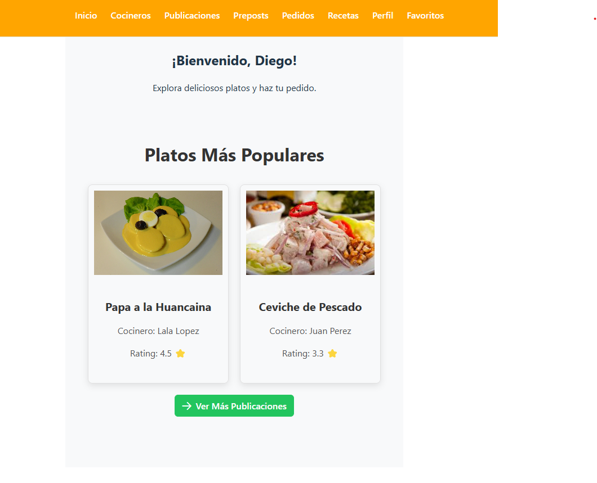
En la seccion Cocineros se puede observar la opcion de añadir a favoritos y se puede observar el nombre de cada chef con su imagen respectiva  
- Sección Cocineros: 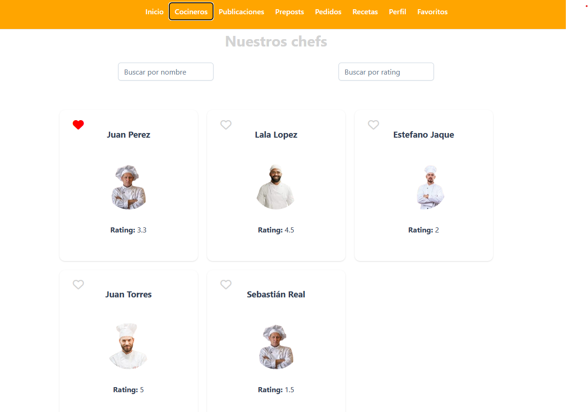
En la seccion publicaciones tenemos la opcion de añadir una nueva publicacion asi como tambien la opcion de poder generara una orden  
- Sección Publicaciones: 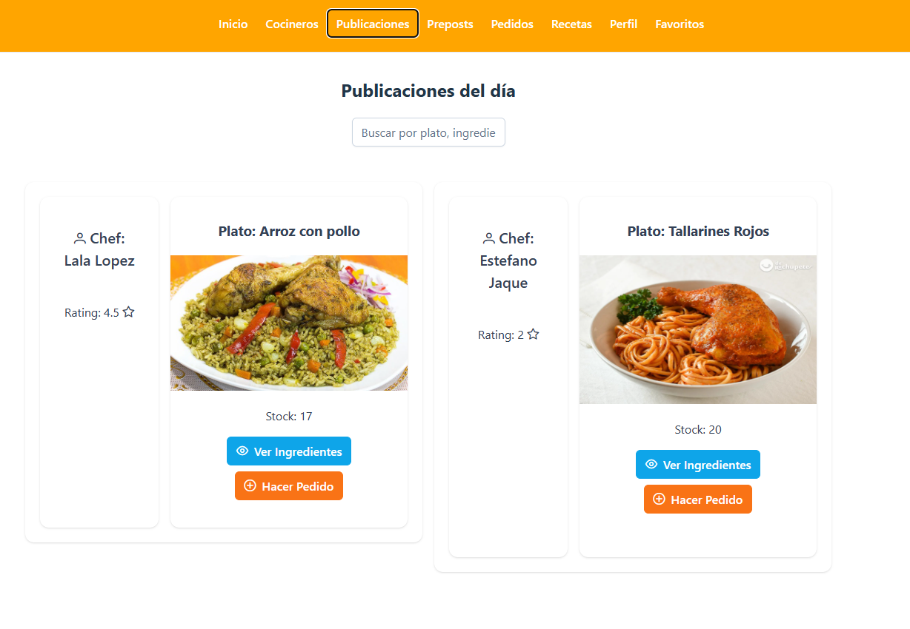
En la seccion de pedidos se puede observar las ordenes realizadas por los usuarios con datos importantes como el monto total , fecha de delivery , hora de delivery ,etc. 
- Sección Pedidos: 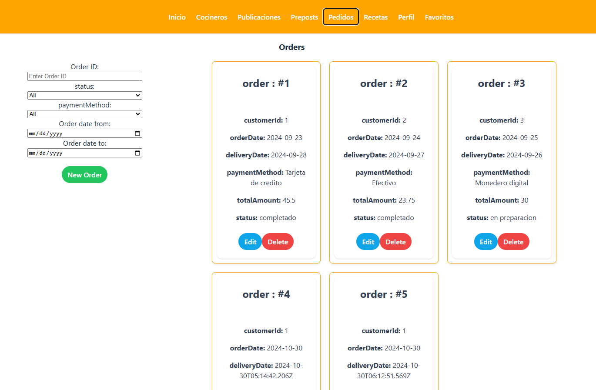
En la seccion recetas tenemos las opciones de añadir , editar y eliminar las recetas. Ademas tenemos la opcion de filtrar las recetas por el nombre para que de esta manera se pueda observar nuestra receta deseada.  
- Sección Recetas: 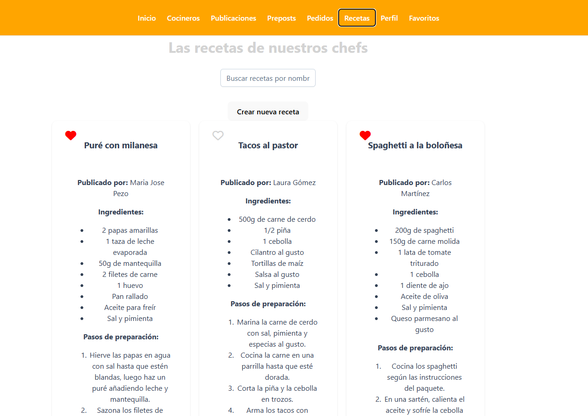
- Sección Perfil: 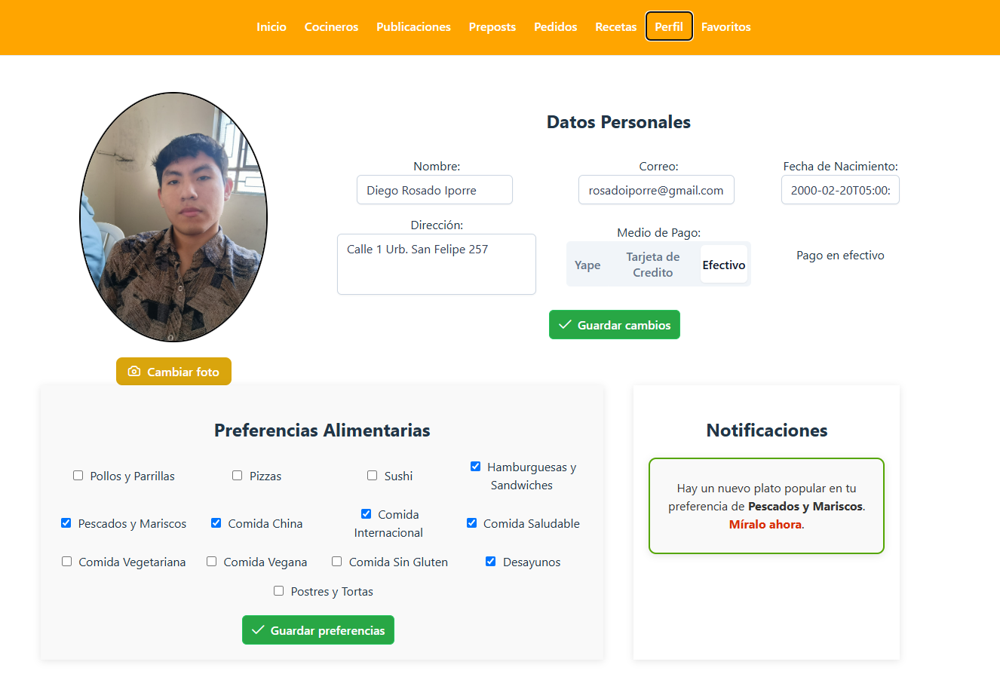
- Sección Favoritos: 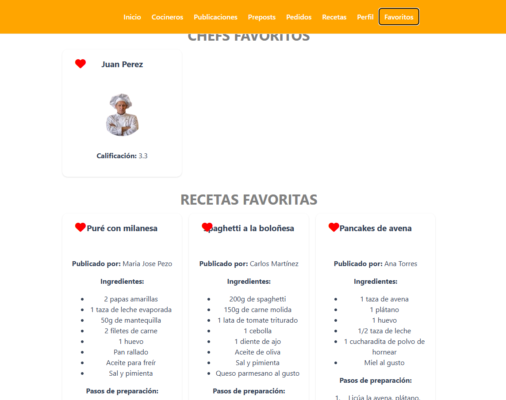

A continuacion se muestra la evidencia de despliegue del frontend entrando al siguiente enlace:   
https://saborescercanos-frontend.web.app/home

**Enlace a Video About the product**  
Ademas presentamos un video explicativo de las funcionalidades en el Frontend:
https://drive.google.com/file/d/1ZnlCrrpk9SlRjT9ExwuQyAYMFVaTtNH_/view?usp=sharing

### 5.2.3.6. Services Documentation Evidence for Sprint Review

En esta sección se incluye la relación de Endpoints documentados con OpenAPI, relacionados con el alcance del Sprint. Se resumen los logros alcanzados en relación con la Documentación de Web Services para este Sprint.

<h3>Backend en Rider</h3>

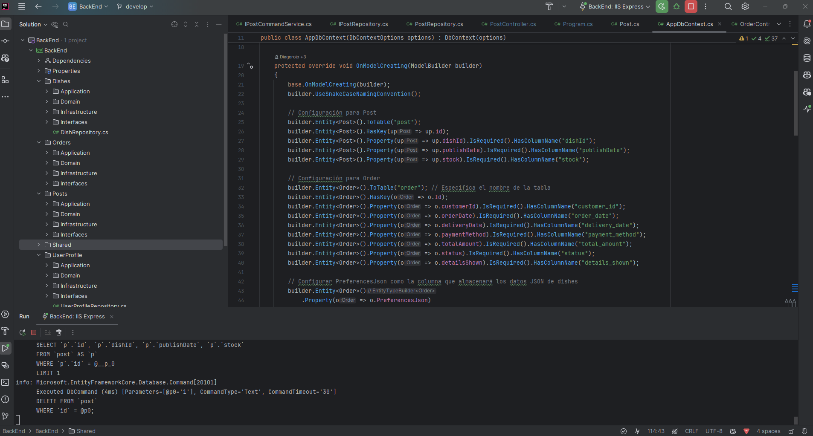 

<h2>Bounded Contexts</h2>

<h3>Dishes Bounded Context</h3>

**DishesController**

| Tag   | HTTP Verbs | Endpoint| Summary| Description| OperationId|
|--|--|--|--|--|--|
| Dishes| POST| /api/v1/dishes| Create a new dish| Create a new dish| CreateDish|
| Dishes| GET| /api/v1/dishes/{id}| Get dish by ID| Retrieve a dish by its ID  | GetDishById|
| Dishes| PUT| /api/v1/dishes/{id}| Update a dish| Update a specific dish| UpdateDish|
| Dishes| DELETE| /api/v1/dishes/{id} | Delete a dish| Remove a specific dish| DeleteDish|

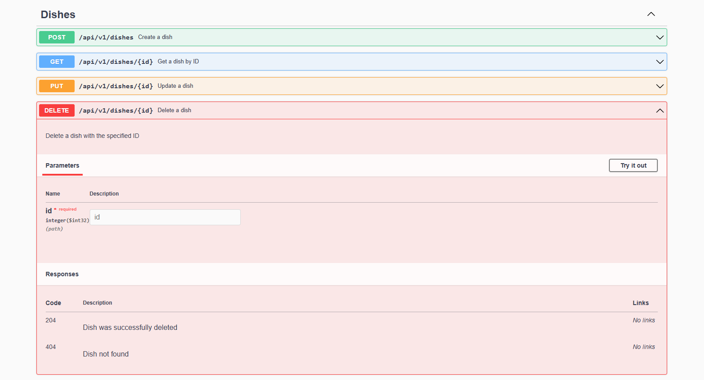 

<h3>Orders Bounded Context</h3>

**OrdersController**

| Tag    | HTTP Verbs | Endpoint            | Summary             | Description                  | OperationId    |
|--------|------------|---------------------|---------------------|------------------------------|----------------|
| Orders | POST       | /api/v1/orders      | Create a new order | Create a new order           | CreateOrder    |
| Orders | GET        | /api/v1/orders/{id} | Get order by ID    | Retrieve an order by its ID  | GetOrderById   |
| Orders | PUT        | /api/v1/orders/{id} | Update an order    | Update a specific order      | UpdateOrder    |
| Orders | DELETE     | /api/v1/orders/{id} | Delete an order    | Remove a specific order      | DeleteOrder    |

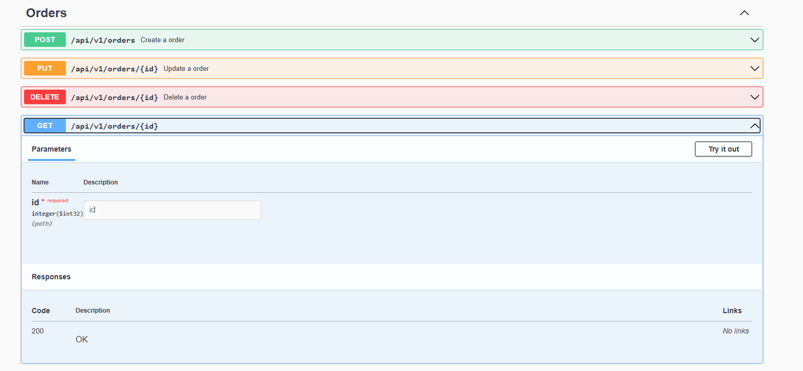 

<h3>Posts Bounded Context</h3>  

**PostsController**

| Tag   | HTTP Verbs | Endpoint           | Summary                   | Description                    | OperationId   |
|-------|------------|--------------------|---------------------------|--------------------------------|---------------|
| Posts | POST       | /api/v1/posts      | Create a new post         | Create a new post              | CreatePost    |
| Posts | GET        | /api/v1/posts/{id} | Get post by ID            | Retrieve a post by its ID      | GetPostById   |
| Posts | PUT        | /api/v1/posts/{id} | Update a post             | Update a specific post         | UpdatePost    |
| Posts | DELETE     | /api/v1/posts/{id} | Delete a post             | Remove a specific post         | DeletePost    |

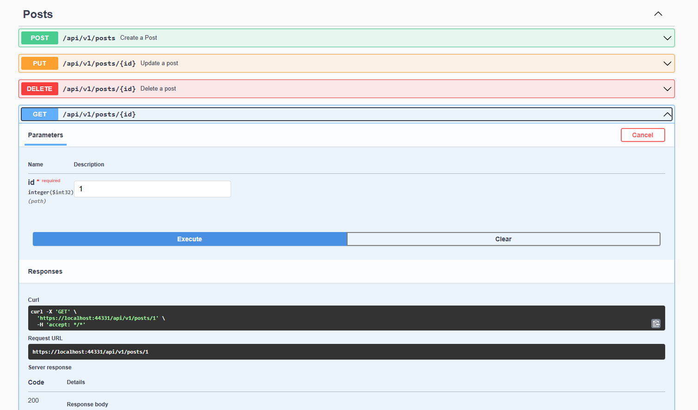 

<h3>UserProfiles Bounded Context</h3>  

**UserProfilesController**

| Tag            | HTTP Verbs | Endpoint                   | Summary                     | Description                       | OperationId         |
|----------------|------------|----------------------------|-----------------------------|-----------------------------------|---------------------|
| User Profiles  | POST       | /api/v1/user-profiles      | Create a user profile       | Create a new user profile         | CreateUserProfile   |
| User Profiles  | GET        | /api/v1/user-profiles/{id} | Get user profile by ID      | Retrieve a user profile by its ID | GetUserProfileById  |
| User Profiles  | PUT        | /api/v1/user-profiles/{id} | Update a user profile       | Update a specific user profile    | UpdateUserProfile   |
| User Profiles  | DELETE     | /api/v1/user-profiles/{id} | Delete a user profile       | Remove a specific user profile    | DeleteUserProfile   |

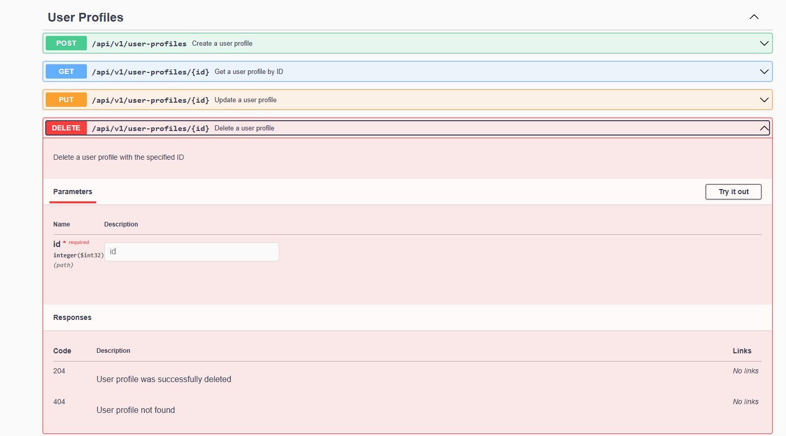 

<h3>Schemas</h3>

- **CreateDishResource**
- **CreateOrderResource**
- **CreatePostResource**
- **CreateUserProfileResource**
- **DishResource**
- **OrderResource**
- **Post**
- **UpdateDishCommand**
- **UpdateOrderCommand**
- **UpdatePostCommand**
- **UpdateUserProfileCommand**
- **UserProfileResource**

Además, puedes ver la evidencia de despliegue del backend en el siguiente enlace:  
rampartmanagewise-fva6azdtgqfjd9ca.canadacentral-01.azurewebsites.net/index.html   

Link del repositorio del backend:   https://github.com/Rampart-SaboresCercanos/BackEnd.git  

### 5.2.3.7. Software Deployment Evidence for Sprint Review
* Para poder realizar la sección del Sprint Se decidió usar la plataforma de Figma donde se realizaron los mockups, wireframes y demás de manera colaborativa por parte del equipo y, con esta misma plataforma, se realizó el prototipo de la aplicacion.

* Para poder entrar al figma del grupo es necesario contar con una cuenta ya registrada y haber iniciado sesión en la plataforma mencionada.

* En este Sprint, hemos llevado a cabo diversas actividades relacionadas con el despliegue (Deployment) de nuestra plataforma, asegurando que todos los componentes estén correctamente configurados y listos para su uso. Las actividades de despliegue abarcan múltiples productos, incluyendo la Landing Page, aplicaciones web y servicios web. A continuación, se detallan los pasos realizados, junto con capturas de pantalla que ilustran el proceso y brindan una visión clara de cada etapa.

<h3>Landing Page</h3>     
Para la Landing Page se ha implementado utilizando GitHub Pages, lo que facilita su acceso y gestión.

  

* En la seccion pages, dentro de la configuracion del repositorio, escoger la rama deseada y seleccionar save para hacer el deploy de esta.

  

* Pasados unos minutos se generará el link para acceder a la landing page.

* Adicionalmente Podemos seleccionar use your GitHub pages website en las opciones de about del repositorio, para poder acceder de una manera mas rapida al link.

Finalmente nos dará un link directo a la Landing page desplegada:  
https://rampart-saborescercanos.github.io/LandingPage/

<h3>Frontend</h3>  
Durante este Sprint, hemos llevado a cabo el despliegue de nuestro sistema, enfocándonos en el frontend. Las actividades realizadas incluyen la configuración del entorno de desarrollo en Firebase, la creación de cuentas en proveedores de servicios en la nube y la automatización del proceso de despliegue.    

**Levantamiento del FakeApi con My JSON Server**  

  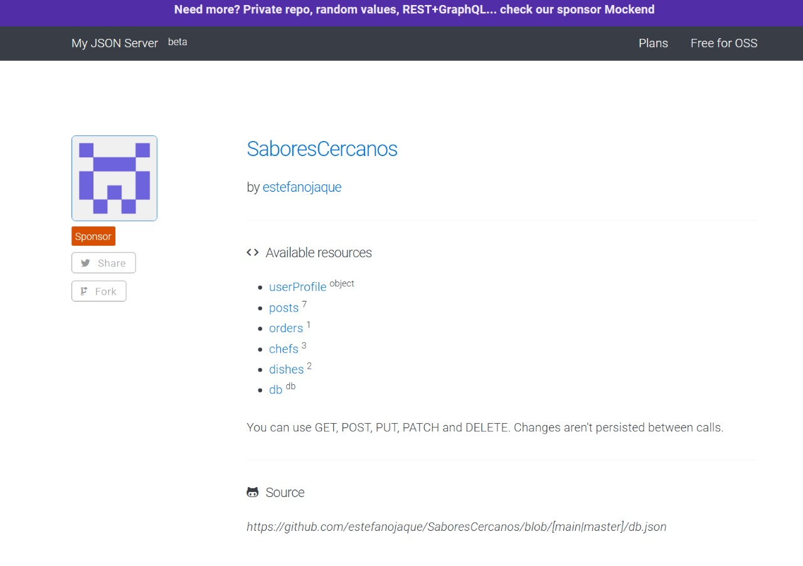  

  Se crea un repositorio , ponemos el bd.json en el repositorio para poder con este crear el link de My JSON Server    
  Una vez puesto este link en los environments y comprobado que funciona el frontend con el link como fakeApi seguimos al siguiente paso.

**Pasos Realizados para el espliegue del Frontend en Firebase Hosting**

1. **Creación de la Cuenta en Firebase**  
  Realizamos la creacion de la cuenta y del proyecto.

    

2. **Configuración del Proyecto en Firebase y en Webstorm**  
  Seleccione Build y luego Hosting. Hicimos clic en Get Started o Comenzar en la sección de Hosting yaque era la primera vez que lo configurabamos en este proyecto

    Se realizo los comandos necesarios en la terminal de nuestro proyecto.

    > npm install -g firebase-tools

    > firebase login

    > firebase init

    > npm run build

    > firebase deploy

    

3. **Verficicacion**  
  Firebase generó una URL pública que permite acceder al sitio en línea.
  
  Enlace al Frontend Desplegado:  
  https://saborescercanos-frontend.web.app/home  

**Conclusiones**
El proceso de despliegue del frontend en Firebase se realizó con éxito, asegurando que todos los elementos estén disponibles y funcionando correctamente en el entorno de producción. Se verificó la accesibilidad de la landing page y se realizaron pruebas para confirmar que todos los enlaces y funciones están operativos.

<h3>Backend</h3>  

Durante este Sprint, hemos llevado a cabo el despliegue de nuestra aplicación backend utilizando Azure. Este proceso incluye la configuración del entorno en Azure, la carga de la aplicación y la verificación de su funcionalidad.

**Despliegue del Backend en Azure**

1. **Acceso y Configuración Inicial**: Ingresé a la plataforma Azure utilizando mi cuenta de estudiante, que proporciona acceso gratuito a diversos servicios.  
2. **Creación del Servicio de Backend**:  
 Generé el entorno para el backend en Azure, seleccionando el servicio adecuado para el despliegue (como Azure App Service o Azure Functions, según sea el caso).
3. **Integración con GitHub**:   Configuré una integración continua con GitHub vinculando mi repositorio al servicio de Azure. Esto permite que cada cambio en el repositorio de GitHub se refleje automáticamente en el servicio de Azure.  
4. **Modificación de Archivos de Configuración**:  
 Realicé ajustes en los archivos de configuración del backend (como `appsettings.json` o variables de entorno) dentro del repositorio para garantizar una conexión exitosa entre el backend y mi cuenta de Azure, configurando detalles como las credenciales y los endpoints necesarios.
5. **Despliegue y Pruebas**: Una vez configurado, el backend fue desplegado en Azure. Verifiqué el despliegue accediendo al endpoint generado y comprobando que las funcionalidades del backend respondieran correctamente.

Este proceso asegura que el backend esté correctamente desplegado y funcional en Azure, con una conexión confiable y sincronizada a través de GitHub. 

**Evidencia de la Base de Datos en swagger(deploy)**
   - Captura de Pantalla de `db.json` utilizado en JSON Server:
    
      

Enlace a la Aplicación Backend Desplegada:  
rampartmanagewise-fva6azdtgqfjd9ca.canadacentral-01.azurewebsites.net/index.html

### 5.2.3.8. Team Collaboration Insights during Sprint

| Integrante | Acciones realizadas durante el sprint |
|-|-|
| Estefano Oscar Jaque Peña | Desarrollo del bounded context de Recetas |
| Diego Alonso Rosado Iporre | Desarrollo del bounded context customer, perfil y home |
| Sebastián Omar Real Calderón | Desarrollo del bounded context Post |
| Jose Antonio Alejo Cardenas | Desarrollo del bounder context de Orders |

**Contribucion en el repositorio del Frontend**

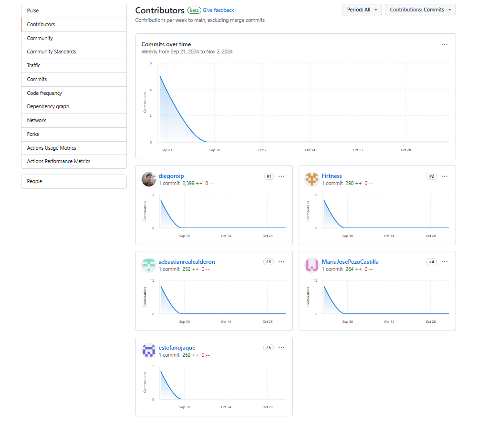

**Contribucion en el repositorio del Backend**

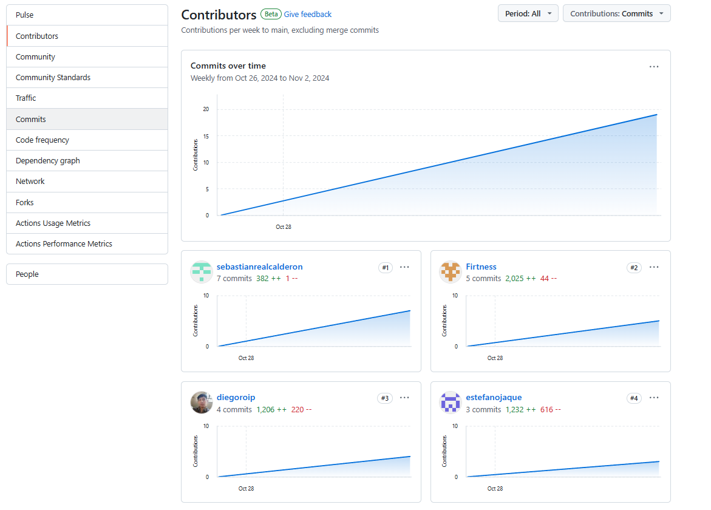

### 5.3. Validation Interviews.

### 5.3.1. Diseño de Entrevistas.

**Objetivo**: Establecer los elementos a incluir en las sesiones de validación, centrándose en el landing page y las aplicaciones. Esto permitirá obtener retroalimentación directa de los usuarios sobre la usabilidad y la experiencia general.

**User Flows**: A continuación, se definen los flujos de usuario que los participantes deben seguir durante las pruebas:

1. **Crear nueva receta**: Los usuarios navegarán por el proceso de añadir una nueva receta a la plataforma, desde el formulario inicial hasta la confirmación de creación.
   
2. **Editar receta creada**: Los usuarios deberán seleccionar una receta existente y modificarla, revisando el proceso de actualización y asegurándose de que los cambios se guarden correctamente.

3. **Actualizar información personal y preferencias alimenticias de un perfil creado**: Los participantes actualizarán su información personal en el perfil, incluyendo datos como nombre, ubicación y preferencias alimenticias. Esto asegurará que sus opciones de menú se ajusten a sus necesidades y gustos.

4. **Ver mis favoritos (chefs y recetas)**: Los usuarios explorarán la sección donde pueden ver sus recetas y chefs favoritos, evaluando la facilidad de acceso y navegación.

5. **Ver órdenes pedidas y su estado**: Los participantes revisarán el historial de pedidos realizados y el estado actual de cada uno (pendiente, completado, en preparación).

**Presentación del Landing Page**: Durante las entrevistas, se mostrará a los participantes el landing page de la plataforma "Sabores Cercanos". Se les pedirá que comenten sobre su impresión inicial, la claridad de la información presentada y cualquier aspecto visual que resalte o confunda.

### 5.3.2. Registro de Entrevistas.

1. **Entrevista 1**: 
    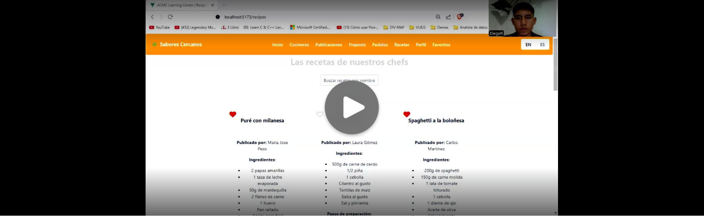 
    **Nombre**: Ana Lucía 
    **Apellidos**: González Paredes 
    **Edad**: 28 
    **Distrito**: Miraflores 
    **URL**: https://upcedupe-my.sharepoint.com/:v:/g/personal/u201620127_upc_edu_pe/EbhWLAhi3W1KiqidfdIzsPwBkoei9vzEo8Hh3sx4cwXXKA?e=53MsKE&nav=eyJyZWZlcnJhbEluZm8iOnsicmVmZXJyYWxBcHAiOiJTdHJlYW1XZWJBcHAiLCJyZWZlcnJhbFZpZXciOiJTaGFyZURpYWxvZy1MaW5rIiwicmVmZXJyYWxBcHBQbGF0Zm9ybSI6IldlYiIsInJlZmVycmFsTW9kZSI6InZpZXcifX0%3D 
    **Inicio**: 0:00 
    **Duración**: 1:45 
    **Resumen**: 
    Durante la entrevista, Ana Lucía completó el flujo de creación de una nueva receta en la plataforma, desde la selección de categoría hasta la confirmación de publicación. Encontró el botón de "Crear nueva receta" de forma intuitiva, aunque sugirió que el ícono podría mejorarse para reflejar más claramente la acción de añadir contenido nuevo. Al interactuar con el formulario de receta, comentó que, aunque le pareció en general fácil de entender, tardó en ubicar el campo de "Descripción" y recomendó agregar una breve ayuda contextual para facilitar la comprensión de lo que se espera en cada campo. También experimentó un problema al intentar cargar varias imágenes, y sugirió que sería útil recibir una notificación si el archivo excede el límite de tamaño permitido. Al finalizar el proceso, encontró la confirmación de creación clara y tranquilizadora, ya que mostraba que la receta estaba publicada y que se podía editar si era necesario. Como sugerencia final, comentó que la experiencia de usuario podría mejorarse al incluir una guía visual o un paso a paso que indique el progreso de creación de la receta, permitiéndole ver cuánto le falta para terminar.

2. **Entrevista 2**: 
    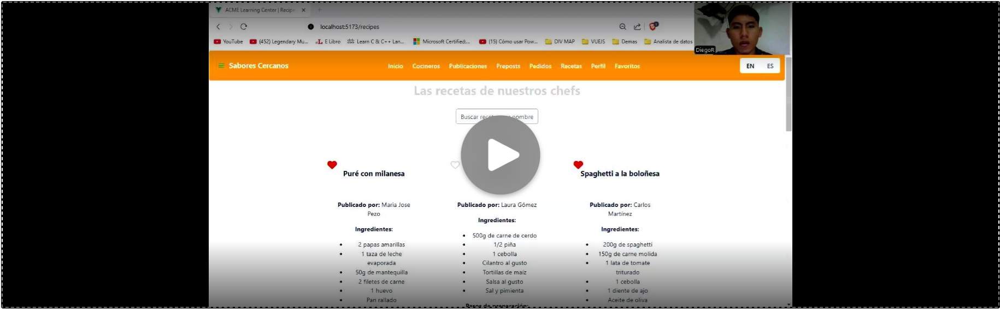 
    **Nombre**: Luis Fernando 
    **Apellidos**: Ramos Velásquez 
    **Edad**: 25 
    **Distrito**: San Borja 
    **URL**: https://upcedupe-my.sharepoint.com/:v:/g/personal/u201620127_upc_edu_pe/EUy-t8yUe8FGvM68BexZvOkBWPuvSYwZdZ9tcMpgcFmoxQ?e=hxeSIm&nav=eyJyZWZlcnJhbEluZm8iOnsicmVmZXJyYWxBcHAiOiJTdHJlYW1XZWJBcHAiLCJyZWZlcnJhbFZpZXciOiJTaGFyZURpYWxvZy1MaW5rIiwicmVmZXJyYWxBcHBQbGF0Zm9ybSI6IldlYiIsInJlZmVycmFsTW9kZSI6InZpZXcifX0%3D 
    **Inicio**: 0:05 
    **Duración**: 1:00 
    **Resumen**: 
    Durante la entrevista, Luis Fernando exploró el proceso de editar una receta ya creada, desde seleccionar una receta existente hasta guardar los cambios realizados. Inicialmente, encontró el menú de "Mis Recetas" de manera rápida, pero señaló que podría destacarse más visualmente para mejorar la navegación. Al editar, notó que los campos de la receta eran claros y fáciles de modificar, aunque sugirió que sería conveniente tener una opción de "Vista previa" antes de guardar los cambios finales. Además, comentó que el botón de "Guardar cambios" debería estar más resaltado para reducir la posibilidad de confusión con otras opciones cercanas. Al finalizar el proceso, confirmó que los cambios se guardaron correctamente y se reflejaron al instante en la vista pública de la receta. Como sugerencia final, Luis Fernando propuso que se incluyera una opción para deshacer los cambios en caso de error, lo cual consideró útil para evitar ediciones no deseadas y mejorar la flexibilidad del proceso de edición.

3. **Entrevista 3**: 
    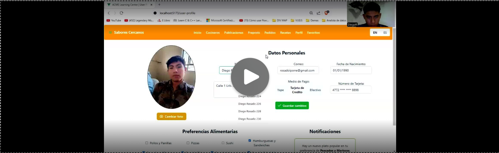 
    **Nombre**: Valeria 
    **Apellidos**: Martínez Díaz 
    **Edad**: 29 
    **Distrito**: La Molina 
    **URL**: https://upcedupe-my.sharepoint.com/:v:/g/personal/u201620127_upc_edu_pe/Eer_aC5CYxhOuqtuOXLS1YQBpri19xuJCMXEmjOQR-ThgA?e=8pQJTz&nav=eyJyZWZlcnJhbEluZm8iOnsicmVmZXJyYWxBcHAiOiJTdHJlYW1XZWJBcHAiLCJyZWZlcnJhbFZpZXciOiJTaGFyZURpYWxvZy1MaW5rIiwicmVmZXJyYWxBcHBQbGF0Zm9ybSI6IldlYiIsInJlZmVycmFsTW9kZSI6InZpZXcifX0%3D 
    **Inicio**: 0:03 
    **Duración**: 2:00 
    **Resumen**: 
    Durante la entrevista, Valeria actualizó su información personal y preferencias alimenticias en el perfil, incluyendo datos como su ubicación y sus preferencias en ingredientes y restricciones dietéticas. Encontró fácilmente la sección de edición de perfil, aunque comentó que la categoría de "Preferencias alimenticias" podría ser más visible, ya que es una de las opciones principales que desea ajustar. Al actualizar sus preferencias, notó que las opciones de ingredientes y restricciones eran completas, pero recomendó agregar un filtro para facilitar la búsqueda de ciertos ingredientes específicos. Luego de guardar los cambios, confirmó que sus opciones de menú reflejaban sus nuevas preferencias correctamente, mostrando platos adaptados a sus necesidades. Como comentario final, Valeria sugirió que sería útil incluir una opción para recibir recomendaciones de recetas basadas en sus gustos recientes, lo cual consideró que enriquecería la personalización del perfil.

4. **Entrevista 4**: 
   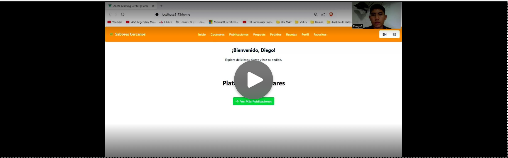 
   **Nombre**: Juan 
   **Apellidos**: Pérez López 
   **Edad**: 28 
   **Distrito**: Miraflores 
   **URL**: https://upcedupe-my.sharepoint.com/:v:/g/personal/u201620127_upc_edu_pe/ER69vILPTWpNotf953S-iEgBm86CkMbXZBgsH-yfAlLoFA?e=VQEPn7&nav=eyJyZWZlcnJhbEluZm8iOnsicmVmZXJyYWxBcHAiOiJTdHJlYW1XZWJBcHAiLCJyZWZlcnJhbFZpZXciOiJTaGFyZURpYWxvZy1MaW5rIiwicmVmZXJyYWxBcHBQbGF0Zm9ybSI6IldlYiIsInJlZmVycmFsTW9kZSI6InZpZXcifX0%3D 
   **Inicio**: 0:00 
   **Duración**: 1:00 
   **Resumen**: 
    Durante la entrevista, Juan mencionó que la sección de favoritos es fundamental para su experiencia en la plataforma. Resaltó la importancia de poder acceder rápidamente a sus recetas y chefs preferidos. La facilidad de navegación fue un punto crítico. Además, mencionó que le gustaría ver un sistema de clasificación visual para sus favoritos, como estrellas o íconos, para identificar rápidamente sus preferencias. En general, expresó que la funcionalidad es útil, pero podría beneficiarse de una mejor organización visual y un sistema de búsqueda más robusto.

5. **Entrevista 5**: 
   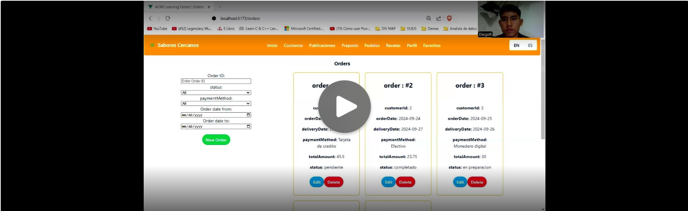 
   **Nombre**: Laura 
   **Apellidos**: Rodríguez Salas 
   **Edad**: 26 
   **Distrito**: San Isidro 
   **URL**: https://upcedupe-my.sharepoint.com/:v:/g/personal/u201620127_upc_edu_pe/EcqP2k1DoNBElX6j0OKoF38BjegI1ukvp-GEkhqCihrpwQ?e=m26EeL&nav=eyJyZWZlcnJhbEluZm8iOnsicmVmZXJyYWxBcHAiOiJTdHJlYW1XZWJBcHAiLCJyZWZlcnJhbFZpZXciOiJTaGFyZURpYWxvZy1MaW5rIiwicmVmZXJyYWxBcHBQbGF0Zm9ybSI6IldlYiIsInJlZmVycmFsTW9kZSI6InZpZXcifX0%3D  
   **Inicio**: 0:00 
   **Duración**: 1:30 
   **Resumen**: 
   En la entrevista, Laura destacó la importancia de poder consultar el historial de pedidos y el estado actual de cada uno. Mencionó que encuentra útil la visualización clara de las órdenes, especialmente la indicación del estado (pendiente, en preparación, completado). Sin embargo, sugirió que sería beneficioso tener notificaciones en tiempo real sobre cambios de estado, lo que le permitiría estar al tanto de sus pedidos sin necesidad de refrescar la página. También comentó que sería útil poder filtrar el historial por fechas y estados de las órdenes, facilitando la búsqueda de pedidos anteriores. En general, Laura se sintió satisfecha con la funcionalidad, pero propuso mejoras en la interacción y la comunicación del estado de los pedidos.

6. **Entrevista 6**: 
   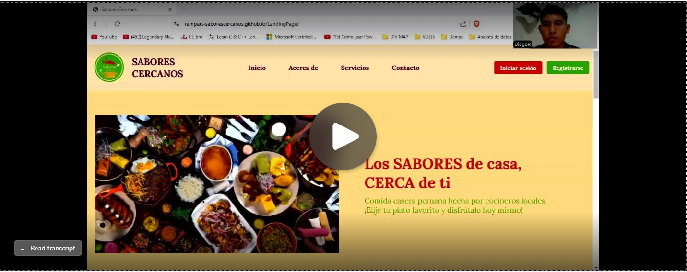 
   **Nombre**: Javier 
   **Apellidos**: Martínez Gómez 
   **Edad**: 28 
   **Distrito**: Miraflores 
   **URL**: https://upcedupe-my.sharepoint.com/:v:/g/personal/u201620127_upc_edu_pe/EQmHL-fuBVtJkSMTIx7e4tMBs9imIgqWP4MscZaadM5y_w?e=0Zzhdi&nav=eyJyZWZlcnJhbEluZm8iOnsicmVmZXJyYWxBcHAiOiJTdHJlYW1XZWJBcHAiLCJyZWZlcnJhbFZpZXciOiJTaGFyZURpYWxvZy1MaW5rIiwicmVmZXJyYWxBcHBQbGF0Zm9ybSI6IldlYiIsInJlZmVycmFsTW9kZSI6InZpZXcifX0%3D 
   **Inicio**: 0:10 
   **Duración**: 2:00 
   **Resumen**: 
   Javier expresó una impresión positiva del landing page de "Sabores Cercanos". Destacó que el diseño es atractivo y que las imágenes de los platos son muy llamativas, lo que despierta el interés en las ofertas. Comentó que la disposición de la información es clara y fácil de seguir, especialmente la sección de menús y precios. Sin embargo, mencionó que le gustaría ver más información sobre los chefs, como sus experiencias y especialidades, ya que esto podría influir en su decisión de compra. También sugirió que un botón de "volver al inicio" en la parte inferior de la página podría mejorar la navegación. En general, se sintió motivado a explorar más la plataforma, pero consideró que algunos elementos visuales podrían ser simplificados para no sobrecargar la vista.

### 5.3.3. Evaluaciones según heurísticas.

Esta sección contiene el proceso de evaluación de las sesiones de validación basado en heurísticas, considerando heurísticas de usabilidad, arquitectura de información e inclusive design de la experiencia propuesta.

# TABLA RESUMEN

| #  | Problema                                                                     | Escala de severidad | Heurística/Principio violado                               |
|----|------------------------------------------------------------------------------|---------------------|-----------------------------------------------------------|
| 1  | No hay un control que permita regresar a la tienda durante el trámite de compra | 3                   | Usabilidad: Libertad y control del usuario                  |
| 2  | Se repiten constantemente algunas opciones                                     | 1                   | Usabilidad: Consistencia y estándares                       |
| 3  | Imágenes sin atributo “alt”                                                  | 3                   | Diseño Inclusivo: Proporciona experiencias comparables      |
| 4  | Incluye un botón “Ver más” pero no existe contenido al que dirigirse         | 3                   | Arquitectura de Información: Is it usable?                  |
| 5  | No incluye información de los planes de servicio                              | 2                   | Arquitectura de Información: Is it findable?                |
| 6  | Falta de notificaciones en tiempo real sobre el estado de pedidos             | 2                   | Usabilidad: Feedback del sistema                             |
| 7  | Necesidad de un sistema de clasificación visual para favoritos                | 2                   | Usabilidad: Reconocimiento en lugar de recuerdo             |
| 8  | Falta de información sobre los chefs en el landing page                      | 3                   | Arquitectura de Información: Is it findable?                |

# DESCRIPCIÓN DE PROBLEMAS

## PROBLEMA #1: No hay un control que permita regresar a la tienda durante el trámite de compra
**Severidad:** 3  
**Heurística violada:** Usabilidad - Libertad y control del usuario  
**Problema:**  
Al momento de ingresar nuestros datos, no podemos regresar a la tienda en caso así lo deseemos. Una vez que el cliente pase al trámite de compra, no hay un botón que lo envíe al inicio de la web, lo cual nos obliga a completar el trámite. Si el usuario desea elegir más productos, debe iniciar un nuevo trámite, incrementándose así el esfuerzo necesario.  
(Incluir además una captura de pantalla ilustrando el problema).

**Recomendación:**  
La solución más práctica sería permitir que, al querer realizar el trámite, el navegador abra la tienda en una ventana aparte para no perder los cambios realizados en el carrito de compras.

---

## PROBLEMA #2: Se repiten constantemente algunas opciones
**Severidad:** 1  
**Heurística violada:** Usabilidad - Consistencia y estándares  
**Problema:**  
La repetición de opciones en diferentes secciones puede generar confusión en el usuario, haciendo que no se sienta seguro al navegar. Esto puede hacer que el proceso de selección sea menos eficiente.

**Recomendación:**  
Revisar las opciones y eliminar duplicaciones para mantener la consistencia en la presentación de la información.

---

## PROBLEMA #3: Imágenes sin atributo “alt”
**Severidad:** 3  
**Heurística violada:** Diseño Inclusivo - Proporciona experiencias comparables  
**Problema:**  
Las imágenes del sitio no cuentan con atributos "alt", lo que dificulta la accesibilidad para usuarios con discapacidades visuales. Sin descripciones, estas imágenes no pueden ser interpretadas por lectores de pantalla.

**Recomendación:**  
Incluir descripciones en el atributo "alt" de cada imagen para mejorar la accesibilidad del sitio.

---

## PROBLEMA #4: Incluye un botón “Ver más” pero no existe contenido al que dirigirse
**Severidad:** 3  
**Heurística violada:** Arquitectura de Información - Is it usable?  
**Problema:**  
El botón “Ver más” se presenta en varias secciones, pero al hacer clic en él, no hay contenido adicional disponible. Esto causa frustración en el usuario, ya que espera más información.

**Recomendación:**  
Eliminar el botón “Ver más” de las secciones donde no se proporciona contenido adicional o asegurarse de que cada botón dirija a un contenido relevante.

---

## PROBLEMA #5: No incluye información de los planes de servicio
**Severidad:** 2  
**Heurística violada:** Arquitectura de Información - Is it findable?  
**Problema:**  
La falta de información clara sobre los planes de servicio puede generar incertidumbre en el usuario sobre las opciones disponibles. Esto puede llevar a la falta de confianza en la plataforma.

**Recomendación:**  
Agregar una sección dedicada a los planes de servicio con descripciones detalladas y precios para mejorar la transparencia.

---

## PROBLEMA #6: Falta de notificaciones en tiempo real sobre el estado de pedidos
**Severidad:** 2  
**Heurística violada:** Usabilidad - Feedback del sistema  
**Problema:**  
Los usuarios no reciben actualizaciones en tiempo real sobre el estado de sus pedidos, lo que puede llevar a la incertidumbre y la necesidad de refrescar la página constantemente.

**Recomendación:**  
Implementar un sistema de notificaciones que informe a los usuarios sobre cambios en el estado de sus pedidos de manera automática.

---

## PROBLEMA #7: Necesidad de un sistema de clasificación visual para favoritos
**Severidad:** 2  
**Heurística violada:** Usabilidad - Reconocimiento en lugar de recuerdo  
**Problema:**  
Los usuarios desean una forma rápida y visual de identificar sus recetas y chefs favoritos. La falta de un sistema de clasificación puede dificultar el acceso a sus preferencias.

**Recomendación:**  
Implementar un sistema de clasificación visual, como estrellas o íconos, para que los usuarios puedan identificar rápidamente sus favoritos.

---

## PROBLEMA #8: Falta de información sobre los chefs en el landing page
**Severidad:** 3  
**Heurística violada:** Arquitectura de Información - Is it findable?  
**Problema:**  
La información sobre los chefs no está presente en la plataforma, lo que puede influir negativamente en la decisión de compra de los usuarios, ya que desean conocer más sobre la experiencia y especialidades de los chefs.

**Recomendación:**  
Agregar perfiles de los chefs que incluyan información sobre su experiencia, especialidades y filosofía culinaria.

### 5.4. Video About-The-Team
**Resumen del Video**
En esta sección, el equipo presenta un resumen de los aspectos más relevantes del video "About-The-Team". El video documenta el proceso de trabajo realizado, incluyendo escenas que muestran imágenes o videos de sesiones de trabajo reales del equipo. A través de una narración, se complementa el proceso con los testimonios de cada participante, describiendo las actividades realizadas, los logros de los resultados (outcomes) y el desarrollo de competencias alcanzadas.

**Pauta de Secuencias de Contenido**
A continuación se detalla la pauta de secuencias de contenido del video, incluyendo el tiempo de inicio de cada sección (hh:mm:ss):

**Cuadro Representativo del Video**
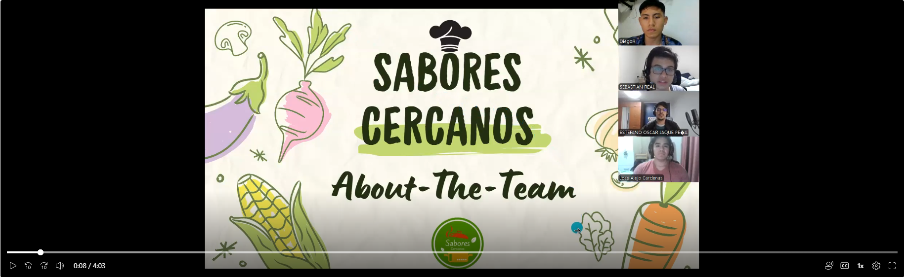 

### URLs de la Versión Publicada
- **Versión en Microsoft Stream**: [DIEGO PON EL VIDEO DE ABOUT THE TEAM]---> el siguiente link de abajo pasalo a GOOGLE DRIVE Y REEMPLAZALO POR ESTE

https://upcedupe-my.sharepoint.com/:v:/g/personal/u201620127_upc_edu_pe/EXUK3OML4FpBgXV_5BnEmZ0B_p7odYVAqrTorjWdhX3RtQ?e=r58kQu&nav=eyJyZWZlcnJhbEluZm8iOnsicmVmZXJyYWxBcHAiOiJTdHJlYW1XZWJBcHAiLCJyZWZlcnJhbFZpZXciOiJTaGFyZURpYWxvZy1MaW5rIiwicmVmZXJyYWxBcHBQbGF0Zm9ybSI6IldlYiIsInJlZmVycmFsTW9kZSI6InZpZXcifX0%3D 

### 5.5. Video About-The-Product

**Resumen del Video**
En esta sección, el equipo presenta un resumen de los aspectos más relevantes del video "About-The-Product". El video documenta las características y funcionalidades clave del producto, mostrando cómo se alinea con las necesidades de nuestros usuarios. A través de una narración, se complementa el proceso con demostraciones visuales del producto en acción, así como testimonios de usuarios que destacan su experiencia y los beneficios obtenidos al utilizarlo.

**Cuadro Representativo del Video**
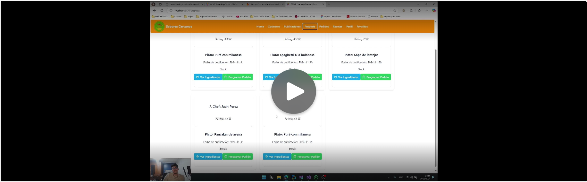

**URLs de la Versión Publicada**

- **Versión en Microsoft Stream**: [https://drive.google.com/file/d/1ZnlCrrpk9SlRjT9ExwuQyAYMFVaTtNH_/view?usp=sharing](https://drive.google.com/file/d/1ZnlCrrpk9SlRjT9ExwuQyAYMFVaTtNH_/view?usp=sharing)

## Conclusiones

Aquí tienes el resumen de las conclusiones por grupo:

- TB2: 
Durante el TB2, el equipo avanzó en la implementación de funcionalidades específicas, como la gestión de pedidos, la verificación de identidad de cocineros, la optimización de rendimiento de imágenes y la creación y edición de recetas. Se mantuvo un enfoque en la escalabilidad y mantenibilidad del sistema, apoyado por una arquitectura de software sólida y una comunicación eficiente dentro del equipo. Este sprint destacó la importancia de la colaboración, la claridad en la asignación de tareas y el compromiso para seguir optimizando el proyecto, orientando el desarrollo hacia una plataforma eficiente y adaptable a las necesidades del mercado. 

## Bibliografia
   - Biblioteca UPC. (2024). _Biblioteca virtual de la Universidad Peruana de Ciencias Aplicadas_. https://biblioteca.upc.edu.pe
   - Miro. (2024). _Miro_. Miro Corporation. https://miro.com
   - LucidChart. (2024). _LucidChart_. Lucid Software Inc. https://www.lucidchart.com
   - Cohn, M. (2006). Historias de usuario: Un enfoque ágil. Pearson Educación.https://www.scrummanager.com/files/scrum_manager_historias_usuario.pdf
   - Pressman, R. S. (2010). Ingeniería de Software: Un enfoque práctico. McGraw-Hill.https://www.javier8a.com/itc/bd1/ld-Ingenieria.de.software.enfoque.practico.7ed.Pressman.PDF
   - The C4 model for visualising software architecture. (2024). https://c4model.com/
   - Structurizr. (2024). https://www.structurizr.com/

## Anexos

Wireframes and Mockups: https://www.figma.com/design/5jRpYDUjHgwpGOIgfgKZLA/Wireframes-Web-App?node-id=24-2&t=6CYRjycdU5lEljAJ-1

Diagrama de clases: https://lucid.app/lucidchart/c228e218-6d6b-484c-8557-0fae7cba2738/edit?viewport_loc=-216%2C49%2C4474%2C2081%2CHWEp-vi-RSFO&invitationId=inv_387afe2d-3886-4d53-a6e8-c42b2ae376e3

Diagrama de base de datos: https://lucid.app/lucidchart/de7494c8-ca20-4b78-8732-fb0986780e5e/edit?viewport_loc=-5%2C469%2C2982%2C1387%2C0_0&invitationId=inv_df6f46c5-10c8-405e-8b2b-2a1a52ca42fa

Anexo B:https://lucid.app/lucidchart/434db23b-883c-43b4-98ea-2da63e5366d5/edit?viewport_loc=-854%2C-13081%2C4706%2C2108%2C0_0&invitationId=inv_f9b021da-b3ba-42f7-b73a-b5085b472ce8

Anexo C:https://lucid.app/lucidchart/434db23b-883c-43b4-98ea-2da63e5366d5/edit?viewport_loc=-854%2C-13081%2C4706%2C2108%2C0_0&invitationId=inv_f9b021da-b3ba-42f7-b73a-b5085b472ce8

Anexo D: https://lucid.app/lucidchart/c228e218-6d6b-484c-8557-0fae7cba2738/edit?viewport_loc=-216%2C49%2C4474%2C2081%2CHWEp-vi-RSFO&invitationId=inv_387afe2d-3886-4d53-a6e8-c42b2ae376e3 

Anexo E:  https://lucid.app/lucidchart/de7494c8-ca20-4b78-8732-fb0986780e5e/edit?viewport_loc=-5%2C469%2C2982%2C1387%2C0_0&invitationId=inv_df6f46c5-10c8-405e-8b2b-2a1a52ca42fa 

ANEFO F: https://drive.google.com/drive/folders/14X--cRiq700Ryxi1WeZE7CM0riqFNCae?usp=sharing

ANEXO G: https://drive.google.com/drive/folders/1aIE_Dj5v-rLgMxIZl-rMrsUlPqoVnidZ?usp=sharing

URL de la organización del proyecto:  https://github.com/Rampart-SaboresCercanos

URL del repositorio del reporte: https://github.com/Rampart-SaboresCercanos/Rampart.git 

URL del repositorio de la landing page: https://github.com/Rampart-SaboresCercanos/LandingPage.git

URL del repositorio del Frontend: https://github.com/Rampart-SaboresCercanos/FrontEnd.git

URL del repositorio del backend: https://github.com/Rampart-SaboresCercanos/BackEnd.git

URL deploy Landing Page:  https://rampart-saborescercanos.github.io/LandingPage/

URL deploy Fronted: https://saborescercanos-frontend.web.app/home

URL deploy  Backend : https://rampartmanagewise-fva6azdtgqfjd9ca.canadacentral-01.azurewebsites.net/index.html

Link de Pivotal tracker(Product Backlog): https://www.pivotaltracker.com/n/projects/2723742

Link de Trello(Sprints Backlog): https://trello.com/invite/b/66e21f40286ffef6ecd79284/ATTI50beba103332d73ab459b9c9963c0ade138D7652/mi-tablero-de-trello

Video about the product(TB2): https://drive.google.com/file/d/1ZnlCrrpk9SlRjT9ExwuQyAYMFVaTtNH_/view?usp=sharing

Video about the team(TB2): [DIEGO PON EL VIDEO DE ABOUT THE TEAM]---> el siguiente link de abajo pasalo a GOOGLE DRIVE Y REEMPLAZALO POR ESTE

https://upcedupe-my.sharepoint.com/:v:/g/personal/u201620127_upc_edu_pe/EXUK3OML4FpBgXV_5BnEmZ0B_p7odYVAqrTorjWdhX3RtQ?e=r58kQu&nav=eyJyZWZlcnJhbEluZm8iOnsicmVmZXJyYWxBcHAiOiJTdHJlYW1XZWJBcHAiLCJyZWZlcnJhbFZpZXciOiJTaGFyZURpYWxvZy1MaW5rIiwicmVmZXJyYWxBcHBQbGF0Zm9ybSI6IldlYiIsInJlZmVycmFsTW9kZSI6InZpZXcifX0%3D 
